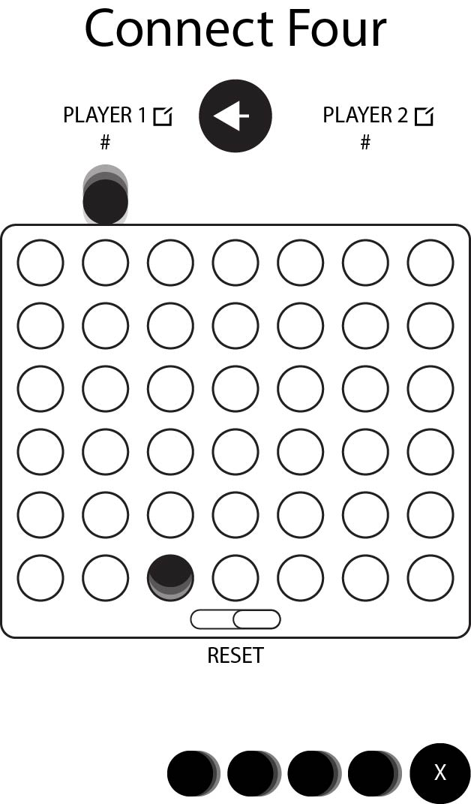

# connect-four
## Overview
For Project One, the goal was to build a game. I choose to build connect-four.

Hover the mouse over the desired column and click to place a piece. This will drop the piece in the desired column, then it will be the next players turn. The players alternate back and forth until one player has placed for pieces in a row, either horizontally, vertically, or diagonally. The players can start the game over if they would like to at any point, but this will alternate who the starting player is.
Player scores for games won are tracked at the top on the designated players score board.

**Link to Game:** [Connet-Four](https://prosset.github.io/connect-four/)

## Links
[Trello Board](https://trello.com/b/2P2oaiUn/connect-four)

## Wireframes

## Technologies
* HTML
* CSS
* Javascript
* Jquery
* Awesome Fonts

## Future Developments
* Add different themes and color schemes
* Custom player names
* Make the site mobile friendly and responsive
* Add A.I.
